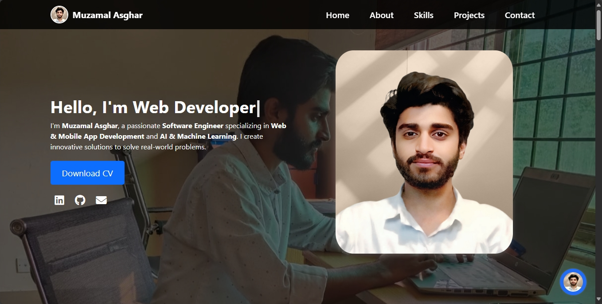

# Muzamal Asghar's Portfolio



🚀 A modern, responsive portfolio website showcasing my skills, projects, and experience as a Software Engineer specializing in Web & Mobile Development and AI & Machine Learning.

[](https://muzamal478.github.io/muzamal-portfolio/)
[](https://github.com/muzamal478/muzamal-portfolio)
[](LICENSE)

## 📖 About the Project

This portfolio is a reflection of my journey as a passionate Software Engineer. It highlights my technical skills, professional projects, and qualifications, built with a focus on clean design, smooth animations, and user-friendly navigation. The site is fully responsive, ensuring a seamless experience across devices, and includes interactive features like a contact form and a chatbot for enhanced user engagement.

### 🎯 Key Features
- **Responsive Design**: Optimized for mobile, tablet, and desktop devices.
- **Interactive Navigation**: Smooth scrolling and fixed navbar with scroll-based styling.
- **Dynamic Hero Section**: Parallax background and typing animation for a modern look.
- **Skills Showcase**: Animated progress bars highlighting proficiency in various technologies.
- **Project Gallery**: Detailed project cards with modal popups for in-depth descriptions.
- **Qualifications**: Organized display of education, technical skills, and certifications.
- **Contact Form**: Easy-to-use form for business inquiries via `mailto`.
- **Chatbot Integration**: Floating action button with BotPenguin chatbot for real-time interaction.
- **Accessibility**: ARIA labels, keyboard navigation, and focus management for inclusivity.
- **Performance**: Lazy-loaded images and optimized assets for fast loading.

## 🛠️ Technologies Used

| Category           | Technologies                                                                 |
|--------------------|------------------------------------------------------------------------------|
| **Frontend**       | HTML5, CSS3, JavaScript (ES6), Bootstrap 5.3                                 |
| **Fonts & Icons**  | Poppins, Roboto, Font Awesome 6.4.2                                          |
| **Animations**     | CSS Keyframes (fadeIn, slideIn, pulse), JavaScript-driven typing and parallax |
| **Chatbot**        | BotPenguin (External SDK)                                                    |
| **Tools**          | Git, GitHub, VS Code, Figma (for UI design)                                  |
| **Deployment**     | GitHub Pages                                                                |

## 🌍 Live Demo

👉 [Explore the Portfolio](https://muzamal478.github.io/muzamal-portfolio/)

## 🚀 Getting Started

Follow these steps to set up and run the project locally.

### Installation

1. **Clone the Repository**:
   ```bash
   git clone https://github.com/muzamal478/muzamal-portfolio.git
   cd muzamal-portfolio
   ```

2. **Install Dependencies**:
   - No additional dependencies are required, as Bootstrap and Font Awesome are included via CDNs.

3. **Run Locally**:
   - Open `index.html` in a browser, or use a local server for best results:
     ```bash
     npx live-server
     ```

### Usage
- Navigate through sections (Home, About, Skills, Projects, Contact) using the fixed navbar.
- Click project cards to view detailed modals.
- Use the contact form to send inquiries via email.
- Interact with the chatbot via the floating action button (requires BotPenguin setup).
- Download the CV from the hero or about section.

## 🛠️ Project Structure

```plaintext
muzamal-portfolio/
├── assets/                    # Images and other static assets
├── index.html                 # Main HTML file
├── styles.css                 # Custom CSS with animations and responsive design
├── script.js                  # JavaScript for interactivity
├── LICENSE                    # MIT License file
└── README.md                  # Project documentation
```

## 📞 Contact Me

Feel free to reach out for collaborations, inquiries, or feedback!

- **Email**: [muzamalasghar47@gmail.com](mailto:muzamalasghar47@gmail.com)
- **LinkedIn**: [Muzamal Asghar](https://linkedin.com/in/muzamalasgharofficial)
- **GitHub**: [muzamal478](https://github.com/muzamal478)

## 🙌 Acknowledgments

- [Bootstrap](https://getbootstrap.com/) for responsive layout and components.
- [Font Awesome](https://fontawesome.com/) for icons.
- [BotPenguin](https://botpenguin.com/) for chatbot integration.
- [GitHub Pages](https://pages.github.com/) for hosting the live demo.

---

⭐ **Star this repository if you find it useful!**  
Happy coding! 🚀
